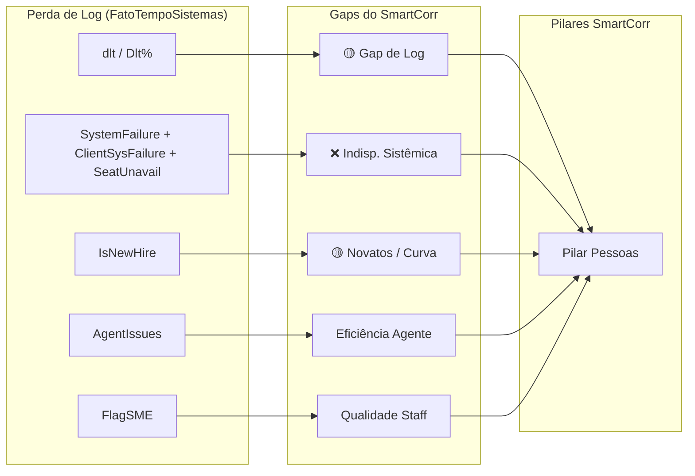

# Análise: Variáveis do Perda de Log para o SmartCorr

## Resumo Executivo

O projeto **Corp - Perda de Log** consome a tabela fato `[OdsCorp].[DataMart].[FatoTempoSistemas]` e cruza com a `factMicroGestao` (que o SmartCorr já utiliza parcialmente). Ele traz um conjunto riquíssimo de variáveis sobre **ineficiência operacional por colaborador/dia**, que depois são agregadas por operação. Muitas dessas variáveis endereçam diretamente os **gaps 🟡 e ❌ identificados** no [MAPEAMENTO_VARIAVEIS.md](file:///c:/TP_ML/BI_Ferramenta_Correlacao_Inteligente/SmartCorr/docs/MAPEAMENTO_VARIAVEIS.md) do SmartCorr — especialmente no **Pilar Pessoas** e no **Pilar TMA**.

---

## 🗄️ Fonte de Dados Principal

| Item                    | Perda de Log                                 | SmartCorr (Atual)                                               |
| ----------------------- | -------------------------------------------- | --------------------------------------------------------------- |
| **Tabela Fato**   | `[OdsCorp].[DataMart].[FatoTempoSistemas]` | `[OdsCorp].[SmartCorr].[vw_SmartCorr_Principal]`              |
| **Granularidade** | **Colaborador × Dia** (FpwId + Date)  | **Programa × Intervalo 30min** (CodPrograma + Intervalo) |
| **Banco**         | OdsCorp (Server: ListBiMis)                  | OdsCorp (Server: SPWS-VM-DB81)                                  |

> [!IMPORTANT]
> A granularidade é diferente. O Perda de Log é **por colaborador/dia**, enquanto o SmartCorr é **por programa/intervalo de 30 min**. Para integrar, será necessário **agregar as variáveis do Perda de Log** por `CellCode` (= Programa) e `Date`, e depois fazer um broadcast diário para os intervalos intraday.

---

## 🎯 Variáveis Candidatas para o SmartCorr

### 🔴 Prioridade Alta — Endereçam Gaps Mapeados

Essas variáveis cobrem deficiências já documentadas no [MAPEAMENTO_VARIAVEIS.md](file:///c:/TP_ML/BI_Ferramenta_Correlacao_Inteligente/SmartCorr/docs/MAPEAMENTO_VARIAVEIS.md):

| # | Variável (Perda de Log)                    | O que Mede                                                                                                                                                             | Gap que Endereça                                 | Tipo no SmartCorr        |
| - | ------------------------------------------- | ---------------------------------------------------------------------------------------------------------------------------------------------------------------------- | ------------------------------------------------- | ------------------------ |
| 1 | **`dlt`** (Delta TempoLogado - PPH) | **Perda de Log pura**: diferença entre tempo <br />logado no CRM e o tempo produtivo pago (PPH). <br />Valor negativo = colaborador logou menos do que deveria. | 🟡**Gap de Log (Atraso)** - Pilar Pessoas   | Feature diária agregada |
| 2 | **`Dlt%`** (= `dlt / PPH_Value`)  | **Taxa de Perda de Log**: percentual de <br />horas perdidas vs planejado.                                                                                       | 🟡**Gap de Log**                            | Feature diária agregada |
| 3 | **`IsNewHire`**                     | Flag: colaborador está em<br />**curva de aprendizagem** (New Hire).                                                                                            | 🟡**Novatos (Curva)** - Pilar Pessoas       | Contagem ou % diário    |
| 4 | **`SystemFailure`**                 | Horas de falha sistêmica (queda do sistema TP).                                                                                                                       | ❌**Indisp. Sistêmica** - Pilar Pessoas | Feature diária          |
| 5 | **`ClientSystemFailure`**           | Horas de falha sistêmica do cliente.                                                                                                                                  | ❌**Indisp. Sistêmica** - Pilar Pessoas | Feature diária          |
| 6 | **`SeatUnavailable`**               | Horas sem posição/estação disponível.                                                                                                                             | ❌**Indisp. Sistêmica** - Pilar Pessoas | Feature diária          |

> [!TIP]
> As variáveis 4, 5 e 6 juntas formam o que o Perda de Log chama de **"Tech Issues"** (`SystemFailure + SeatUnavailable + ClientSystemFailure`). Esse composto é um proxy poderoso para o item "Indisponibilidade Sistêmica" que estava marcado como ❌ (bloqueado pelo Diário de Bordo).

### 🟡 Prioridade Média — Enriquecem o Modelo Atual

| #  | Variável (Perda de Log)               | O que Mede                                                                                    | Pilar SmartCorr          | Tipo no SmartCorr        |
| -- | -------------------------------------- | --------------------------------------------------------------------------------------------- | ------------------------ | ------------------------ |
| 7  | **`AgentIssues`**              | Horas de problemas do agente (não sistêmicos).                                             | Pessoas (Eficiência)    | Feature diária          |
| 8  | **`AutoAdj`**                  | Horas de ajuste automático aplicado pelo sistema.                                           | Pessoas (Aderência)     | Feature diária          |
| 9  | **`TempoLogadoCRM`**           | **Total de horas logadas** no CRM por colaborador.                                      | Pessoas (HC efetivo)     | Para validação cruzada |
| 10 | **`PPH_Value`**                | **Horas Produtivas Pagas** (Productive Paid Hours).                                     | Pessoas (Benchmark)      | Feature diária          |
| 11 | **`Ausência Real`**           | Ausência real em horas (calculada via delta negativo<br /> capped pela ausência planejada). | Pessoas (ABS refinado)   | Feature diária          |
| 12 | **`FlagSME`**                  | Marca se o colaborador é SME (Subject Matter Expert).                                       | Pessoas (qualidade do staff) | % diário                |
| 13 | **`FlagTreinamentoDeslogado`** | Colaborador em treinamento deslogado<br /> (não contabiliza no CRM).                        | Pessoas (Aderência)     | Contagem diária         |
| 14 | **`WorktimeType`**             | Tipo de jornada (escala do colaborador).                                                      | Pessoas / Contexto       | Categórica              |
| 15 | **`AMT`**                      | **Auxiliary Measured Time** — tempo auxiliar medido.                                   | TMA (componente extra)   | Feature diária          |

---

## 📐 Como Integrar: Proposta de Engenharia

### Passo 1: Query de Agregação

Agregar as variáveis do `FatoTempoSistemas` por **`CellCode` + `Date`** (programa + dia):

```sql
SELECT
    F.[Date]                                    AS DataRef,
    F.[CellCode]                                AS CodPrograma,
  
    -- Perda de Log Agregada
    SUM(F.[dlt])                                AS PerdaLog_Total_Sec,
    SUM(F.[PPH_Value])                          AS PPH_Total_Sec,
    CASE WHEN SUM(F.[PPH_Value]) > 0 
         THEN SUM(F.[dlt]) / SUM(F.[PPH_Value]) 
         ELSE 0 END                             AS PerdaLog_Taxa_Daily,
  
    -- Indisponibilidade Sistêmica (proxy)
    SUM(F.[SystemFailure])                      AS SysFailure_Sec_Daily,
    SUM(F.[ClientSystemFailure])                AS ClientSysFailure_Sec_Daily,
    SUM(F.[SeatUnavailable])                    AS SeatUnavail_Sec_Daily,
    SUM(ISNULL(F.[SystemFailure],0) 
      + ISNULL(F.[ClientSystemFailure],0) 
      + ISNULL(F.[SeatUnavailable],0))          AS TechIssues_Total_Sec_Daily,
  
    -- Qualidade do Staff
    SUM(CASE WHEN FT.IsNewHire = 1 THEN 1 ELSE 0 END)  AS NewHire_Qtd_Daily,
    COUNT(DISTINCT F.[FpwId])                            AS HC_Total_Daily,
    CASE WHEN COUNT(DISTINCT F.[FpwId]) > 0
         THEN CAST(SUM(CASE WHEN FT.IsNewHire = 1 THEN 1 ELSE 0 END) AS FLOAT) 
              / COUNT(DISTINCT F.[FpwId])
         ELSE 0 END                             AS NewHire_Pct_Daily,
  
    -- Problemas do Agente
    SUM(F.[AgentIssues])                        AS AgentIssues_Sec_Daily,
  
    -- Flag SME
    SUM(CASE WHEN E.PositionCode = 140468 THEN 1 ELSE 0 END) AS SME_Qtd_Daily

FROM [OdsCorp].[DataMart].[FatoTempoSistemas] F WITH (NOLOCK)
LEFT JOIN [OdsCorp].[DataMart].[factMicroGestao] FT WITH (NOLOCK)
    ON F.[Date] = FT.[Date] 
    AND F.[FpwId] = FT.[FpwIdHierarchyLevel1]
LEFT JOIN [OdsFpw].[dbo].[Employee] E WITH (NOLOCK)
    ON F.[FpwId] = E.[FpwId]
    AND F.[Date] >= E.[ValidFromCtrl]
    AND F.[Date] < E.[ValidToCtrl]
    AND E.[ExclusionDateCtrl] IS NULL
WHERE F.[CellCode] IN (
    366845, 370587, 370588, 548619, 581345,
    581346, 589266, 589360, 589361, 591529,
    347851, 347858, 353059, 355491, 355492
)
GROUP BY F.[Date], F.[CellCode]
```

### Passo 2: Features no [params.yaml](file:///c:/TP_ML/BI_Ferramenta_Correlacao_Inteligente/SmartCorr/params.yaml)

```yaml
# --- INDICADORES DE PERDA DE LOG (Diários - Broadcast) ---
- PerdaLog_Taxa_Daily          # % de horas perdidas vs PPH
- TechIssues_Taxa_Daily        # Taxa de indisponibilidade sistêmica
- NewHire_Pct_Daily            # % de novatos na operação
- AgentIssues_Taxa_Daily       # Taxa de problemas do agente
```

### Passo 3: Feature Engineering ([build_features.py](file:///c:/TP_ML/BI_Ferramenta_Correlacao_Inteligente/SmartCorr/src/feature_engineering/build_features.py))

```python
# Taxas relativas (normalizar pelo HC ou PPH da operação)
df['TechIssues_Taxa_Daily'] = np.where(
    df['PPH_Total_Sec'] > 0,
    df['TechIssues_Total_Sec_Daily'] / df['PPH_Total_Sec'],
    0.0
)

df['AgentIssues_Taxa_Daily'] = np.where(
    df['PPH_Total_Sec'] > 0, 
    df['AgentIssues_Sec_Daily'] / df['PPH_Total_Sec'],
    0.0
)
```

---

## 📊 Mapa de Impacto no Modelo



---

## ✅ Resumo da Recomendação

| Gap Original (MAPEAMENTO) | Status Anterior | Variável do Perda de Log                                        |     Novo Status     |
| ------------------------- | :-------------: | ---------------------------------------------------------------- | :------------------: |
| Gap de Log (Atraso)       |       🟡       | `dlt` / `Dlt%`                                               |    ✅ Disponível    |
| Indisp. Sistêmica        |  ❌ Bloqueado  | `TechIssues` (`SystemFailure` + `Client...` + `Seat...`) | ✅ Proxy disponível |
| Novatos (Curva)           |       🟡       | `IsNewHire`                                                    |    ✅ Disponível    |

> [!CAUTION]
> As variáveis do Perda de Log são **diárias** (1 valor por dia por programa). No SmartCorr a granularidade é de **30 minutos**. Isso significa que essas features serão *broadcast* (o mesmo valor repetido em todos os intervalos do dia). Isso é aceitável para o modelo porque representam **condições contextuais do dia** (como ABS, Férias e Faltas já fazem), mas não capturam variação intradiária.
