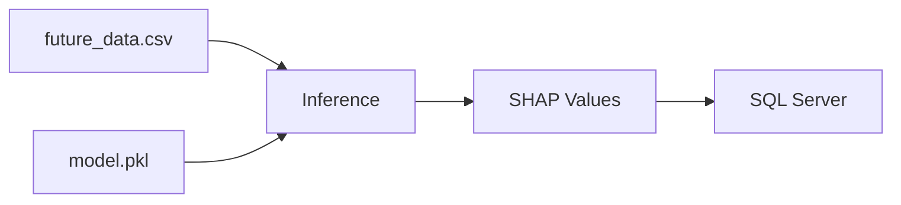

# Inference Module

> Inferência do modelo XGBoost com explicabilidade SHAP.

## Quick Start

```bash
python -m src.inference.predict
```

## Arquitetura

```
┌─────────────────────────────────────────────────────────────┐
│                         main()                               │
│                   (Orquestração do Pipeline)                 │
└─────────────────────────┬───────────────────────────────────┘
                          │
                          ▼
┌─────────────────────────────────────────────────────────────┐
│                   load_config()                               │
│                (Carrega params.yaml)                        │
└─────────────────────────┬───────────────────────────────────┘
                          │
                          ▼
┌─────────────────────────────────────────────────────────────┐
│                    joblib.load()                              │
│              (Carrega modelo .pkl)                         │
└─────────────────────────┬───────────────────────────────────┘
                          │
                          ▼
┌─────────────────────────────────────────────────────────────┐
│                  pd.read_csv()                                │
│             (Carrega future_data.csv)                       │
└─────────────────────────┬───────────────────────────────────┘
                          │
                          ▼
┌─────────────────────────────────────────────────────────────┐
│                    modelo.predict()                           │
│            (Predição do Nível de Serviço)                    │
└─────────────────────────┬───────────────────────────────────┘
                          │
                          ▼
┌─────────────────────────────────────────────────────────────┐
│              calcular_explicabilidade_shap()                  │
│                 (SHAP TreeExplainer)                          │
└─────────────────────────┬───────────────────────────────────┘
                          │
                          ▼
┌─────────────────────────────────────────────────────────────┐
│                 processar_previsoes()                         │
│      (Agrega por pilar, identifica ofensores)                │
└─────────────────────────┬───────────────────────────────────┘
                          │
                          ▼
┌─────────────────────────────────────────────────────────────┐
│                   salvar_no_banco()                           │
│          (INSERT no SQL Server via fast_executemany)         │
└─────────────────────────────────────────────────────────────┘
```

## Pipeline Flow

| Step | Função | Descrição |
|------|--------|------------|
| 1 | `main()` | Orquestra pipeline |
| 2 | `load_config()` | Carrega params.yaml |
| 3 | `joblib.load()` | Carrega modelo treinado |
| 4 | `pd.read_csv()` | Carrega dados futuros |
| 5 | `modelo.predict()` | Predição NS |
| 6 | `calcular_explicabilidade_shap()` | SHAP values |
| 7 | `processar_previsoes()` | Agrega por pilar |
| 8 | `salvar_no_banco()` | Grava no SQL Server |

## Pilares Analíticos

Mapeamento de features para agrupamento semântico no SHAP:

| Pilar | Features | Descrição |
|-------|----------|------------|
| `Volumetria` | `Vol_Previsto`, `Taxa_Abandono_Lag_1`, `Desvio_Volume_Pct_Lag_1` | Volume de chamadas e desvios |
| `Pessoas` | `HC_Previsto`, `ABS_Taxa_Daily`, `Turnover_Taxa_Daily`, etc. | Indicadores de RH e absenteísmo |
| `TMA` | `Tempo_AHT_Previsto_Total`, `TME_Real_Avg_Lag_1`, `Delta_TMA_Lag_1` | Tempo médio de atendimento |
| `Causas_Raiz` | `Pressao_Prevista_Vol_HC`, `Indicador_Sufoco`, etc. | Features sintéticas de causa |
| `Contexto_Temporal` | `Hora`, `DiaSemana` | Padrões sazonais |

## SHAP Values

### O que são?

SHAP (SHapley Additive exPlanations) atribui a cada feature um valor que representa seu impacto na predição:

- **Positivo**: Aumenta o NS previsto
- **Negativo**: Reduz o NS previsto
- **Zero**: Sem impacto significativo

### Processamento

```python
# Para cada linha (intervalo):
1. feature_impactos.sort()  # Ordena do mais negativo ao mais positivo
2. ofensores = [:3]        # 3 mais negativos (prejudicam NS)
3. impulsionadores = [-3:] # 3 mais positivos (ajudam NS)
4. Soma por pilar          # Acumula impacto de cada pilar
```

### Filtro de Ruído

```python
ofensores = [o if o["impacto"] < -0.001 else None for o in ofensores]
impulsionadores = [i if i["impacto"] > 0.001 else None for i in impulsionadores]
```
Ignora impactos menores que 0.1% do NS.

## API Reference

### `load_config() -> dict`

Carrega configurações do `params.yaml`.

---

### `get_pilar(feature_name: str) -> str`

Retorna o pilar analítico de uma feature.

| Parâmetro | Tipo | Descrição |
|-----------|------|------------|
| feature_name | str | Nome da feature |

---

### `calcular_explicabilidade_shap(modelo, X) -> np.ndarray`

Gera valores SHAP usando TreeExplainer.

| Parâmetro | Tipo | Descrição |
|-----------|------|------------|
| modelo | Any | Modelo XGBoost treinado |
| X | pd.DataFrame | Features de entrada |

---

### `processar_previsoes(df, predicoes, shap_values, features) -> list[tuple]`

Transforma predições em tuplas para banco.

**Retorna tupla com:**
- Identificação (DataRef, Intervalo, CodPrograma, Canal)
- Predição (NS_Previsto)
- Metadados (Vol, HC, TMA, NS_Lag_1, TME_Real, Desvio_Volume)
- Impactos por pilar (5 pilares)
- Top 3 ofensores (nome, pilar, impacto)
- Top 3 impulsionadores (nome, pilar, impacto)

---

### `salvar_no_banco(tuplas_dados) -> None`

Grava tuplas no SQL Server.

**Estratégia:**
1. Delete cirúrgico (apenas intervalos afetados)
2. Insert via `fast_executemany`
3. Commit ou Rollback

---

### `main() -> None`

Orquestra pipeline completo.

## Banco de Dados

### Tabela Destino

`[OdsCorp].[SmartCorr].[FactSmartCorr_Previsao]`

### Colunas Gravadas

| Categoria | Colunas |
|-----------|---------|
| Identificação | `DataRef`, `Intervalo`, `CodPrograma`, `Canal` |
| Predição | `NS_Previsto_SmartCorr` |
| Metadados | `Vol_Previsto`, `HC_Previsto`, `TMA_Previsto_Avg`, `NS_Lag_1`, `TME_Real_Lag_1`, `Desvio_Volume_Pct_Lag_1` |
| Pilares | `Impacto_Pilar_Volumetria`, `Impacto_Pilar_Pessoas`, `Impacto_Pilar_TMA`, `Impacto_Pilar_CausasRaiz`, `Impacto_Pilar_Contexto` |
| Ofensores | `Ofensor_1/2/3_Nome`, `_Pilar`, `_Impacto` |
| Impulsionadores | `Impulsionador_1/2/3_Nome`, `_Pilar`, `_Impacto` |

### DDL - Novas Colunas

```sql
ALTER TABLE [OdsCorp].[SmartCorr].[FactSmartCorr_Previsao]
ADD [TME_Real_Lag_1] DECIMAL(10, 4) NULL,
    [Desvio_Volume_Pct_Lag_1] DECIMAL(10, 4) NULL;
```

## Configuration

### params.yaml

```yaml
data:
  processed_future_path: data/processed/future_data.csv

model:
  path: models/model.pkl

inference:
  output_path: data/processed/predictions.csv
```

## Logging

```python
logger = logging.getLogger(__name__)
```

| Level | Mensagem |
|-------|----------|
| INFO | Carregando modelo |
| INFO | Lendo dados Futuros |
| INFO | Predição do Nível de Serviço |
| INFO | SHAP Values para Explicabilidade |
| INFO | Processando impactos por pilar |
| INFO | Limpando previsões antigas |
| INFO | Gravando N registros SHAP |
| INFO | Pipeline Finalizado |
| WARNING | Arquivo futuro ausente |
| WARNING | Base do Futuro vazia |
| ERROR | Erro ao salvar Fato |

## Requisitos

```txt
pandas>=2.0.0
numpy>=1.24.0
scikit-learn>=1.0.0
xgboost>=2.0.0
shap>=0.40.0
joblib>=1.0.0
pyyaml>=6.0
```

## Dependências



## Exemplo de Saída

```json
{
  "DataRef": "2026-04-12",
  "Intervalo": "09:00:00",
  "NS_Previsto_SmartCorr": 0.85,
  "Impacto_Pilar_Volumetria": 0.02,
  "Impacto_Pilar_Pessoas": -0.05,
  "Impacto_Pilar_TMA": 0.08,
  "Impacto_Pilar_CausasRaiz": 0.10,
  "Ofensor_1_Nome": "Taxa_Abandono_Lag_1",
  "Ofensor_1_Pilar": "Volumetria",
  "Ofensor_1_Impacto": -0.035,
  "Impulsionador_1_Nome": "Pressao_Prevista_Vol_HC",
  "Impulsionador_1_Pilar": "Causas_Raiz",
  "Impulsionador_1_Impacto": 0.045
}
```

## Related Documentation

- [Model Training](../model_training/README.md)
- [Feature Engineering](../feature_engineering/README.md)
- [Model Evaluation](../model_evaluation/README.md)
